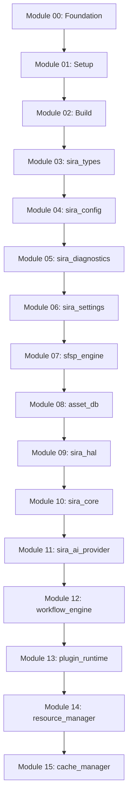

# ARCHITECTURE BASELINE v2.0
**Siragugal Film Studio**  
**Document Version**: 2.0.0  
**Status**: APPROVED & FROZEN ARCHITECTURE BASELINE  
**Author**: AG (Chief Software Architect)  

---

## 1. Executive Summary

This document establishes the official frozen **Architecture Baseline v2.0** for **Siragugal Film Studio**. Having successfully implemented and verified all 16 Phase 1 Infrastructure Modules (Modules 00 through 15), this baseline freezes the foundational software contracts, IPC protocols, module boundaries, error registries, format specifications, and public APIs.

Future architectural modifications MUST go through a formal Architecture Decision Record (ADR) revision process approved by the Chief Software Architect.

---

## 2. Platform & System Constraints

- **Primary Operating System**: macOS 13.0+ (Apple Silicon MPS / Metal compute acceleration)
- **Secondary Operating System**: Windows 11 64-bit (NVIDIA CUDA / DirectML / Vulkan acceleration)
- **Toolchain Pins**: Node.js `v20.11.1`, Rust `v1.76.0`, C++20 standard
- **License Model**: Open Source (Dual Apache-2.0 / MIT)

---

## 3. Frozen Package Inventory & Stability Matrix

| Package Name | Language / Ecosystem | Purpose | Stability Level | Breaking Policy |
| :--- | :--- | :--- | :--- | :--- |
| **`@sira/core-types`** | TypeScript | Shared core TS interfaces & primitives | **STABLE** | Strict SemVer |
| **`sira_types`** | Rust Crate | Shared core Rust structs, timecode & error types | **STABLE** | Strict SemVer |
| **`sira_config`** | Rust Crate | 6-tier configuration loading engine | **STABLE** | Strict SemVer |
| **`sira_diagnostics`** | Rust Crate | OpenTelemetry structured JSON logger & redaction | **STABLE** | Strict SemVer |
| **`sira_settings`** | Rust Crate | User settings manager & atomic file store | **STABLE** | Strict SemVer |
| **`sfsp_engine`** | Rust Crate | `.sfsp` package format container engine | **STABLE** | Backward 1.x |
| **`asset_db`** | Rust Crate | Embedded SQLite relational asset indexer & FTS5 | **STABLE** | Strict SemVer |
| **`sira_hal`** | Rust / C++20 | Capability-based Hardware Abstraction Layer | **STABLE** | Strict SemVer |
| **`sira_core`** | Rust Crate | SIRA AI Core runtime & sub-engine supervisor | **STABLE** | Strict SemVer |
| **`sira_ai_provider`** | Rust Crate | Capability router, model registry & provider API | **STABLE** | Strict SemVer |
| **`workflow_engine`** | Rust Crate | DAG graph validator (`SIRA-5012`) & `.sfsw` engine | **STABLE** | Strict SemVer |
| **`plugin_runtime`** | Rust Crate | Sandboxed Wasmtime WASI plugin engine | **STABLE** | Strict SemVer |
| **`resource_manager`** | Rust Crate | VRAM/RAM reservation leases & LRU eviction | **STABLE** | Strict SemVer |
| **`cache_manager`** | Rust Crate | 8-category cache manager & SQLite `cache.db` | **STABLE** | Strict SemVer |

---

## 4. Frozen Dependency Topology

---

## 5. Frozen Architectural Standards

1. **6-Tier Configuration Hierarchy**: Code Defaults → System Config → User Config → Project Config → `SIRA_*` Env Vars → CLI Arguments.
2. **Error Code Ranges**: Reserved ranges `SIRA-1000` to `SIRA-7999` across all subsystems.
3. **IPC Protocol**: gRPC over Unix Domain Sockets / Named Pipes + zero-copy Shared Memory ring buffers for video frame transport.
4. **Plugin Sandbox Security**: Wasmtime WASI WebAssembly isolation + 10-tier permission boundary checks (`SIRA-6004`).
5. **Project Container (.sfsp)**: SQLite WAL mode (`project.db`) + `manifest.json` + `project.lock` + reserved asset sub-directories.
6. **Cache Storage**: 8-category multi-tier RAM/SSD storage indexed via SQLite `cache.db`.
