# ARCHITECTURE SEQUENCE DIAGRAMS
**Siragugal Film Studio**  
**Document Version**: 1.0.0  
**Status**: APPROVED ARCHITECTURE REFERENCE DIAGRAMS  
**Author**: AG (Permanent Chief Software Architect)  

---

## 1. Project Creation

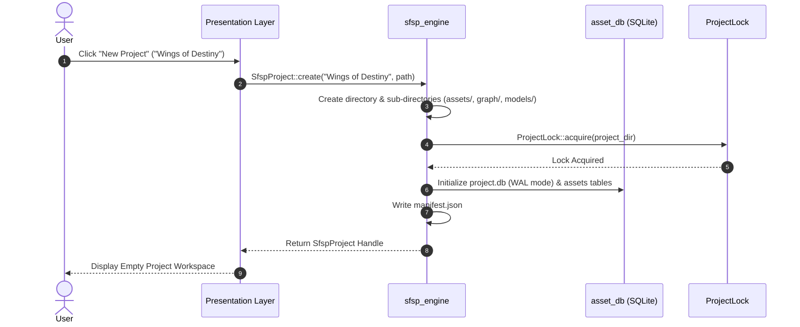

---

## 2. Project Open

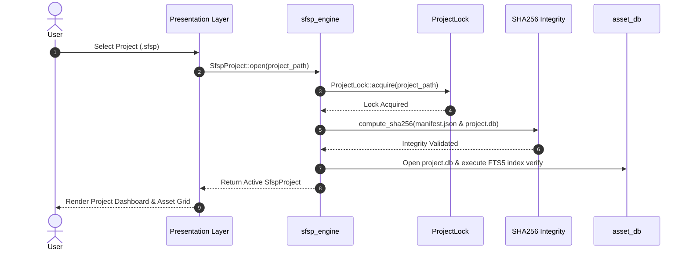

---

## 3. Voice → Film Workflow Execution

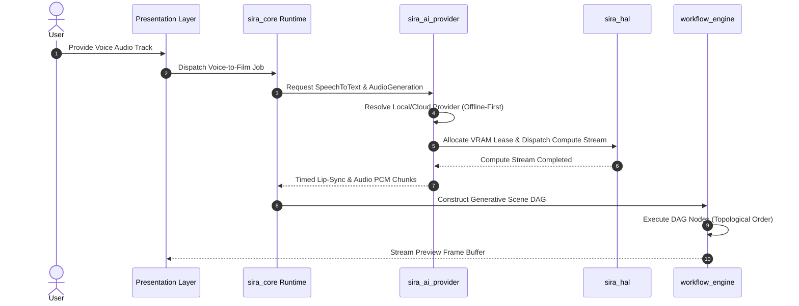

---

## 4. Text → Film Workflow Execution

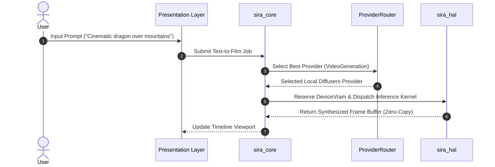

---

## 5. Script → Film Workflow Execution

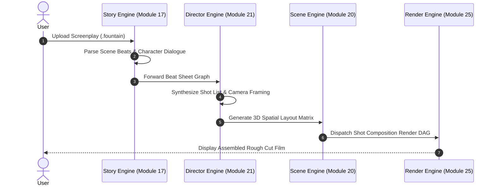

---

## 6. Workflow DAG Execution Pipeline

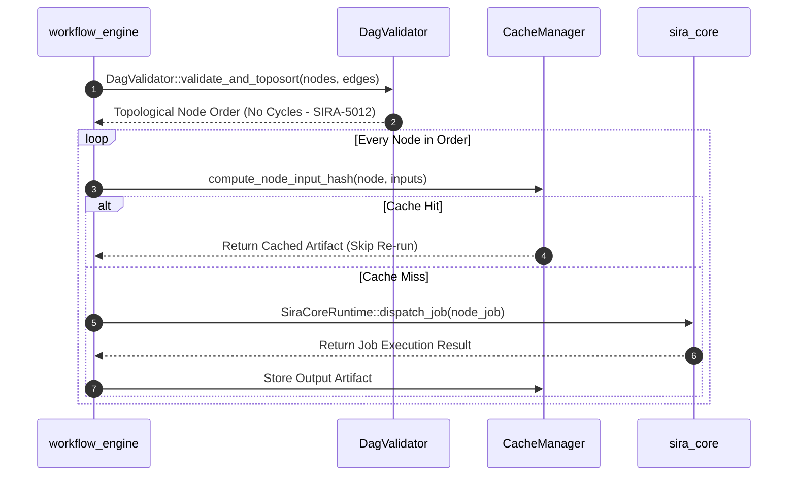

---

## 7. Plugin Execution Sandbox Flow

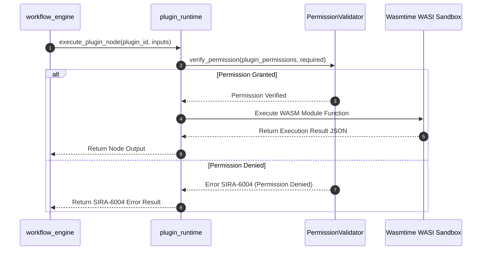

---

## 8. AI Provider Request Flow

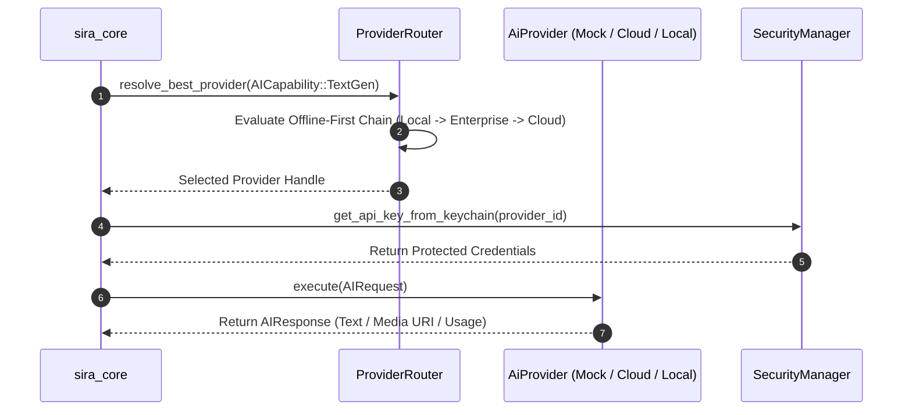

---

## 9. Render Pipeline

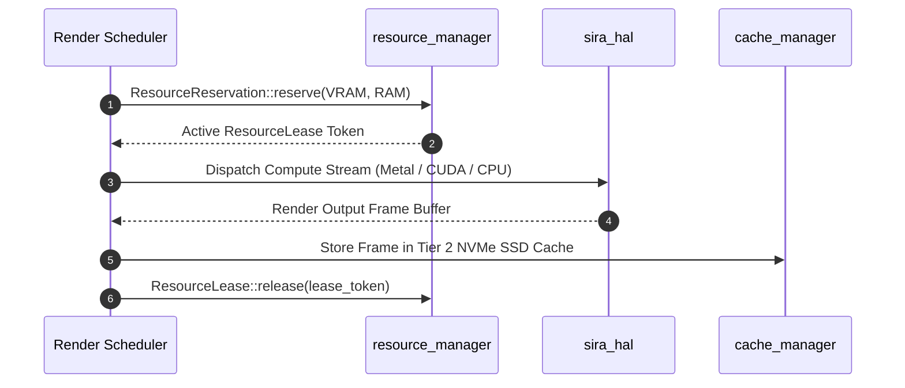

---

## 10. Project Save

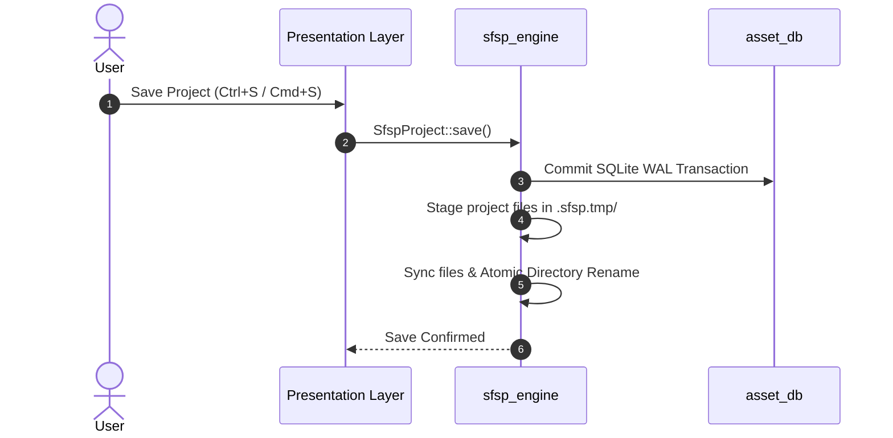

---

## 11. Universal Undo / Redo Flow (ADR-0004)

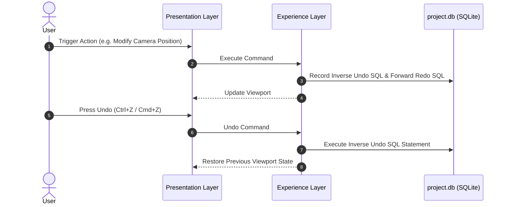

---

## 12. Crash Recovery Flow

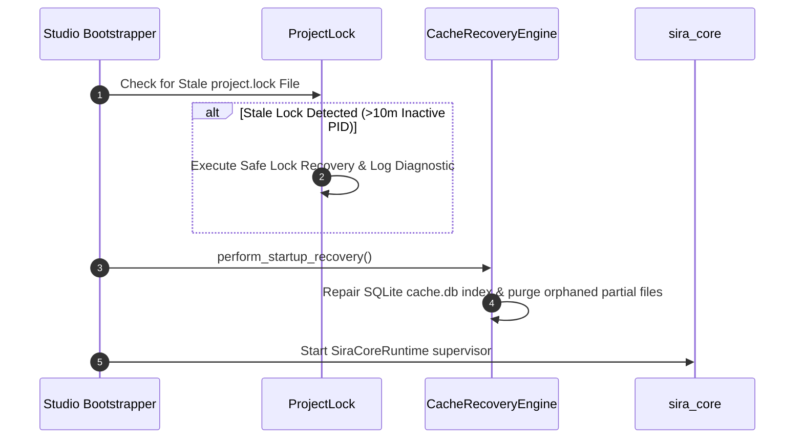
