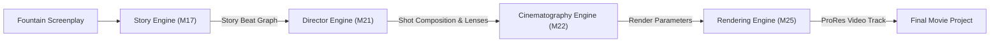
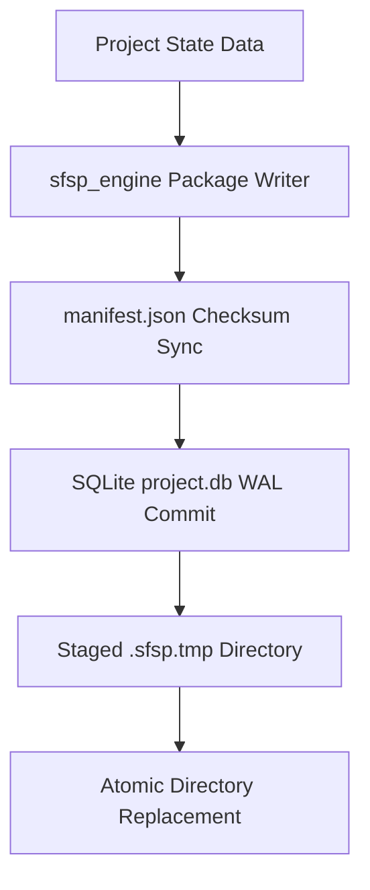

# DATA FLOW ARCHITECTURE
**Siragugal Film Studio**  
**Document Version**: 1.0.0  
**Status**: APPROVED DATA FLOW ARCHITECTURE SPECIFICATION  
**Author**: AG (Permanent Chief Software Architect)  

---

## 1. Voice → Film End-to-End Data Flow

```mermaid
flowchart LR
    A["Raw Dialogue Audio"] --> B["Actor Engine (M19)"]
    B -->|"SpeechToText & Lip-Sync"| C["Script Breakdown Matrix"]
    C --> D["Scene Engine (M20)"]
    D -->|"3D Camera & Pose Grid"| E["Workflow Engine (M12)"]
    E -->|"DAG Execution"| F["Rendering Engine (M25)"]
    F -->|"Zero-Copy Frames"| G["NLE Timeline Output"]
```

---

## 2. Script → Film End-to-End Data Flow

---

## 3. Save / Open Storage Pipeline Flow

