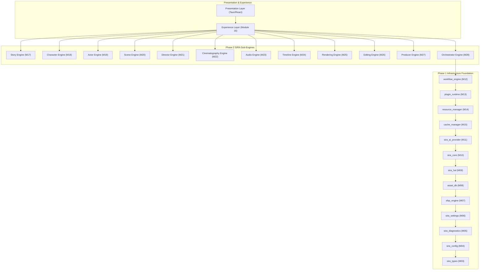

# DEPENDENCY GRAPH v2.0
**Siragugal Film Studio**  
**Document Version**: 2.0.0  
**Status**: APPROVED COMPREHENSIVE DEPENDENCY GRAPH  
**Author**: AG (Permanent Chief Software Architect)  

---

## 1. Complete System Dependency Topology

---

## 2. Dependency Rules

1. **Acyclic Invariant**: Dependencies flow strictly downward from Presentation → Phase 2 Sub-Engines → Phase 1 Infrastructure.
2. **Infrastructure Independence**: Lower-level infrastructure crates NEVER depend on Phase 2 sub-engines or presentation modules.
3. **Hardware Isolation**: AI sub-engines execute compute strictly through `sira_hal` and `sira_ai_provider`, never calling GPU drivers directly.
