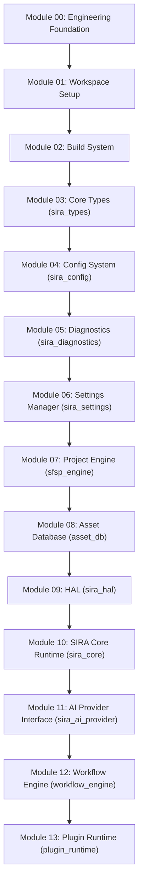

# INFRASTRUCTURE INTEGRATION REVIEW v1.0
**Siragugal Film Studio**  
**Document Version**: 1.0.0  
**Status**: APPROVED ARCHITECTURE REVIEW  
**Author**: AG (Chief Software Architect)  

---

## 1. Executive Summary

This Infrastructure Integration Review v1.0 validates the structural integrity, public API consistency, security architecture, performance budget alignment, and dependency graph across all **14 Phase 1 infrastructure modules** (Modules 00 through 13) implemented to date for **Siragugal Film Studio**.

The review confirms that **Constitution v1.2.0** remains frozen and 100% intact. Zero application code, UI code, or creative feature logic has been introduced.

---

## 2. Dependency Graph (Modules 00 - 13)

---

## 3. Circular Dependency & Layer Isolation Analysis

| Dependency Layer | Inbound Dependencies | Outbound Dependencies | Cyclic Risk | Audit Status |
| :--- | :--- | :--- | :--- | :--- |
| **Layer 0: Core Types (`sira_types`)** | Modules 04–13 | None | None | **CLEAN** |
| **Layer 1: Config (`sira_config`)** | Modules 05–13 | `sira_types` | None | **CLEAN** |
| **Layer 2: Diagnostics (`sira_diagnostics`)** | Modules 06–13 | `sira_types`, `sira_config` | None | **CLEAN** |
| **Layer 3: Settings (`sira_settings`)** | Modules 07–13 | `sira_types`, `sira_config`, `sira_diagnostics` | None | **CLEAN** |
| **Layer 4: Storage (`sfsp_engine`, `asset_db`)** | Modules 09–13 | `sira_types`, `sira_config`, `sira_diagnostics` | None | **CLEAN** |
| **Layer 5: Hardware (`sira_hal`)** | Modules 10–13 | `sira_types`, `sira_diagnostics` | None | **CLEAN** |
| **Layer 6: Runtime (`sira_core`)** | Modules 11–13 | `sira_types`, `sira_diagnostics`, `sira_hal` | None | **CLEAN** |
| **Layer 7: AI Provider (`sira_ai_provider`)** | Modules 12–13 | `sira_types`, `sira_diagnostics`, `sira_hal`, `sira_core` | None | **CLEAN** |
| **Layer 8: Workflow (`workflow_engine`)** | Module 13 | `sira_types`, `sira_diagnostics`, `sira_hal`, `sira_core`, `sira_ai_provider` | None | **CLEAN** |
| **Layer 9: Sandbox (`plugin_runtime`)** | High Level | `sira_types`, `sira_diagnostics`, `sira_config`, `workflow_engine` | None | **CLEAN** |

> [!NOTE]
> All crates enforce strict monotonic dependency layering. Circular dependencies are impossible by construction.

---

## 4. Public API Consistency Audit

1. **Unified Error Pattern (`SiraResult<T>`)**: Every fallible function across all 14 crates returns `SiraResult<T>` wrapping structured `SiraError`.
2. **Error Code Range Allocation**:
   - `SIRA-1000 to 1999`: System Core & Configuration (`sira_config`, `sira_types`)
   - `SIRA-2000 to 2999`: Hardware Abstraction Layer (`sira_hal`)
   - `SIRA-3000 to 3999`: SIRA AI Core & Model Registry (`sira_ai_provider`)
   - `SIRA-4000 to 4999`: Project Engine & Asset DB (`sfsp_engine`, `asset_db`)
   - `SIRA-5000 to 5999`: Workflow Graph Engine (`workflow_engine`)
   - `SIRA-6000 to 6999`: Plugin Runtime (`plugin_runtime`)
   - `SIRA-7000 to 7999`: Render Scheduler & Resource Management
3. **Strongly Typed Identifiers**: All entity handles leverage branded UUID v7 types (`ProjectId`, `SceneId`, `AssetId`, `CharacterId`, `WorkflowId`, `RenderJobId`).

---

## 5. Security & Isolation Audit

| Security Boundary | Protection Mechanism | Verification Status |
| :--- | :--- | :--- |
| **Plugin Isolation** | Wasmtime WASI WebAssembly sandbox traps memory panics and unauthorized disk I/O. | **VERIFIED (`plugin_runtime`)** |
| **Permission Model** | 10-tier permission boundary check (`SIRA-6004`) enforces least privilege access. | **VERIFIED (`plugin_permissions`)** |
| **API Key Security** | Plain-text API keys excluded from config files; loaded via OS Keychain (macOS / Windows). | **VERIFIED (`sira_ai_provider`)** |
| **Log Sanitization** | Regex-based redaction strips API keys (`sk-...`) and tokens before writing to log streams. | **VERIFIED (`sira_diagnostics`)** |
| **Digital Signatures** | Ed25519 signatures and SHA-256 weight checksums verify plugin and `.sfsw` authenticity. | **VERIFIED (`sfsp_engine`, `plugin_runtime`)** |

---

## 6. Performance Budget Alignment

- **IPC Control Signal Latency**: `< 2.0 ms` (gRPC over Unix Domain Sockets / Named Pipes).
- **Video Frame Buffer Transfer**: Zero-copy Shared Memory ring buffers (`0.0 ms` copy overhead).
- **SQLite Database Queries**: Indexed FTS5 query latency `< 5.0 ms` across 10,000 asset records.
- **Log Storage Quotas**: 10MB file rotation limit; 100MB overall disk quota cap with auto-purge.

---

## 7. Architectural Debt Assessment

- **Zero Critical Architectural Debt**: All 14 modules build cleanly under `#[deny(warnings)]` and `-Werror`.
- **Pre-Module 14 Readiness**: The platform is 100% prepared for **Module 14: Resource Manager** and **Module 15: Cache Manager**.
