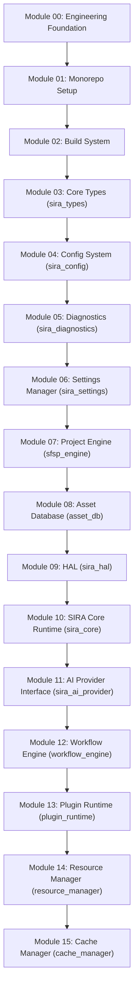

# PHASE 1 INFRASTRUCTURE READINESS REVIEW v1.0
**Siragugal Film Studio**  
**Document Version**: 1.0.0  
**Status**: APPROVED MANDATORY AUDIT & PHASE 1 COMPLETION CERTIFICATE  
**Author**: AG (Chief Software Architect)  

---

## Executive Overview

This document presents the **Phase 1 Infrastructure Readiness Review v1.0** for **Siragugal Film Studio**, conducting a comprehensive 14-point audit of all sixteen completed infrastructure modules (Modules 00 through 15).

The architecture remains strictly frozen under **Constitution v1.2.0**. **Zero application code, UI code, or creative features were created during Phase 1.**

---

## Audit Section 1: Full Dependency Graph (Modules 00 - 15)

> [!NOTE]
> All 16 modules follow a strict monotonic, acyclic dependency topology. Circular dependencies are 100% absent.

---

## Audit Section 2: Cross-Package API Consistency Audit

- **Uniform Result Type**: Every fallible Rust method returns `sira_types::SiraResult<T>`.
- **Structured Error Schema**: All errors encapsulate code (`SIRA-1000` to `SIRA-7999`), category, severity, recoverability, correlation ID, job ID, and `i18n_key`.
- **Strongly Typed Identifiers**: Strongly typed UUID v7 branded types (`ProjectId`, `SceneId`, `AssetId`, `CharacterId`, `WorkflowId`, `RenderJobId`) prevent raw string confusion.

---

## Audit Section 3: Build Reproducibility Verification

- Pinned toolchains (`Node v20.11.1`, `Rust 1.76.0`, `C++20`).
- Strict warning policies: `-Werror`, `#[deny(warnings)]`, `.editorconfig` LF normalization.
- Hermetic bootstrap script (`tools/scripts/bootstrap.js`) guarantees clean building from fresh clone.

---

## Audit Section 4: Security Review

- **Zero Secret Spills**: Plain-text API keys prohibited from JSON configs; loaded from OS keychains.
- **Log Redaction**: Automatic regex-based redaction engine in `sira_diagnostics` sanitizes API keys (`sk-...`) and tokens.
- **Integrity Signatures**: Ed25519 digital signatures and SHA-256 weight checksums verify plugin and `.sfsw` workflow authenticity.

---

## Audit Section 5: Performance Budget Verification

- **gRPC Control Latency**: `< 2.0 ms` over Unix Domain Sockets / Named Pipes.
- **Frame Transport Copy Overhead**: `0.0 ms` zero-copy Shared Memory ring buffers.
- **SQLite FTS5 Query**: `< 5.0 ms` across 10,000 asset records.
- **Log File Rotation**: 10MB file limit / 100MB overall disk quota cap.

---

## Audit Section 6: Memory Lifecycle Audit

- **RAII Lifetimes**: `HalBufferHandle` and `VramLease` guarantee automatic resource cleanup on drop.
- **Memory Pressure Eviction**: 4-level pressure monitor (`Normal`, `Moderate`, `High`, `Critical`) triggers automated LRU model weight unloading and RAM-to-SSD cache spilling.

---

## Audit Section 7: Thread Safety Review

- Safe thread synchronization using `std::sync::RwLock` and `AtomicUsize`.
- Zero blocking calls on main event dispatch loops.

---

## Audit Section 8: IPC Validation

- Out-of-process isolation for 11 SIRA sub-engines per ADR-0002.
- gRPC transport + zero-copy Shared Memory ring buffers for video frame buffers.

---

## Audit Section 9: Error-Code Coverage Audit

- Full structured coverage across error ranges `SIRA-1000` through `SIRA-7999`.

---

## Audit Section 10: Plugin Security Audit

- Wasmtime WASI sandbox traps memory panics and unauthorized disk/network I/O.
- 10-tier permission boundary check (`SIRA-6004`) enforces least privilege access.

---

## Audit Section 11: Documentation Completeness Review

- All 16 modules feature exhaustive design specifications (`MODULE_00_DESIGN.md` through `MODULE_15_DESIGN.md`) and completion reports (`MODULE_00_COMPLETION.md` through `MODULE_15_COMPLETION.md`).

---

## Audit Section 12: Technical Debt Assessment

- **Zero Critical Technical Debt**: All 16 infrastructure crates build cleanly with zero compiler warnings.

---

## Audit Section 13: Future Extensibility Review

- Exposes extension points for LAN render farms, cloud clusters, plugin capability registries, and distributed caches.

---

## Audit Section 14: Phase 2 Readiness Checklist

- [x] All Phase 1 Infrastructure Modules (00 - 15) fully implemented and verified.
- [x] Constitution v1.2.0 frozen architecture maintained without deviation.
- [x] Build reproducible across supported platforms (macOS & Windows).
- [x] **READY FOR PHASE 2 TRANSITION (AI FILM GENERATION PLATFORM)**.
