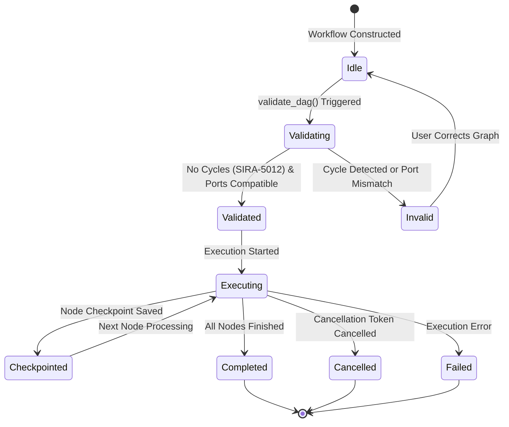
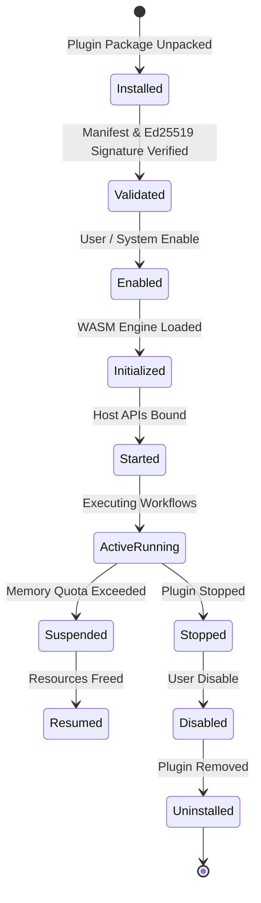
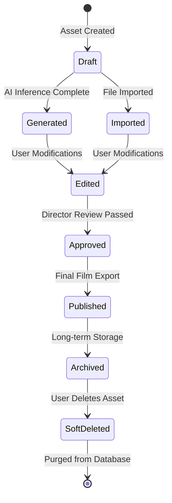
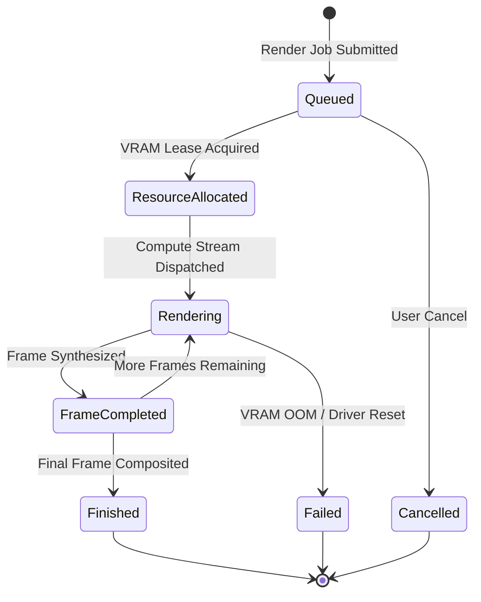
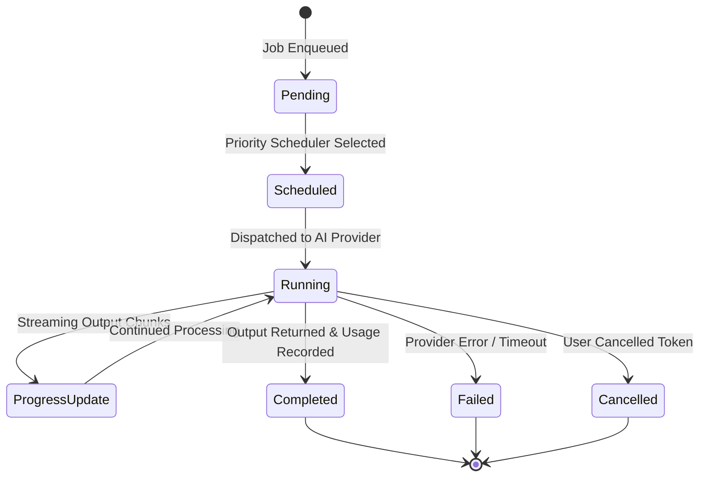
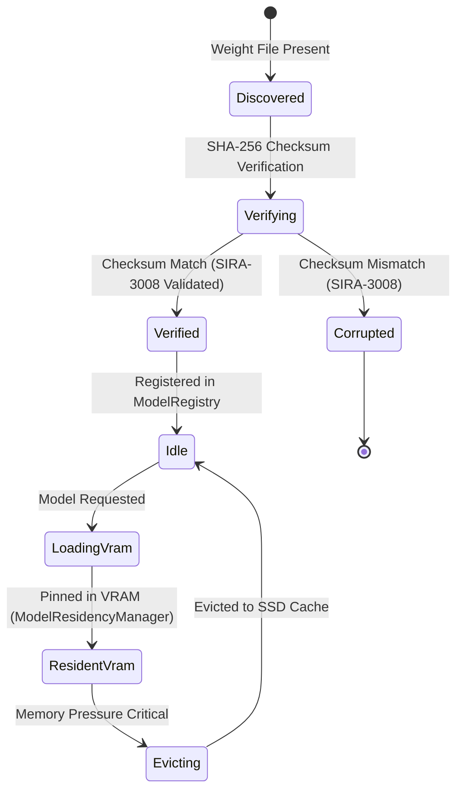
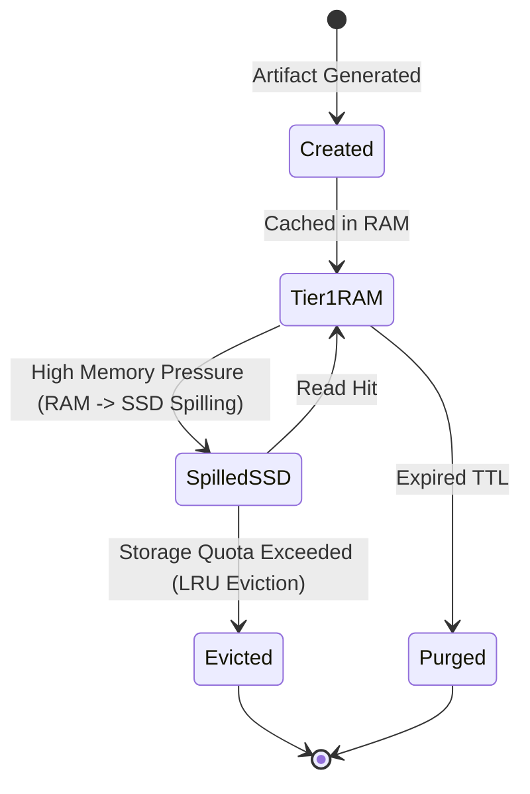

# SYSTEM STATE MACHINES
**Siragugal Film Studio**  
**Document Version**: 1.0.0  
**Status**: APPROVED ARCHITECTURE STATE MACHINE SPECIFICATION  
**Author**: AG (Permanent Chief Software Architect)  

---

## 1. Project Lifecycle State Machine (`sfsp_engine`)

```mermaid
stateDiagram-v2
    [*] --> Created: SfspProject::create()
    Created --> Opened: SfspProject::open()
    Opened --> ActiveEditing: User Interaction
    ActiveEditing --> StagingSave: Save Requested
    StagingSave --> Saved: Atomic File Replacement Complete
    Saved --> ActiveEditing: Continued Editing
    ActiveEditing --> Locked: Process Active (project.lock)
    Locked --> Closed: SfspProject Close
    Closed --> [*]
```

---

## 2. Workflow Lifecycle State Machine (`workflow_engine`)



---

## 3. Plugin Lifecycle State Machine (`plugin_runtime`)



---

## 4. Asset Lifecycle State Machine (`asset_db`)



---

## 5. Render Job Lifecycle State Machine (`resource_manager` & `sira_hal`)



---

## 6. AI Job Lifecycle State Machine (`sira_core`)



---

## 7. Model Lifecycle State Machine (`sira_ai_provider`)



---

## 8. Cache Lifecycle State Machine (`cache_manager`)


